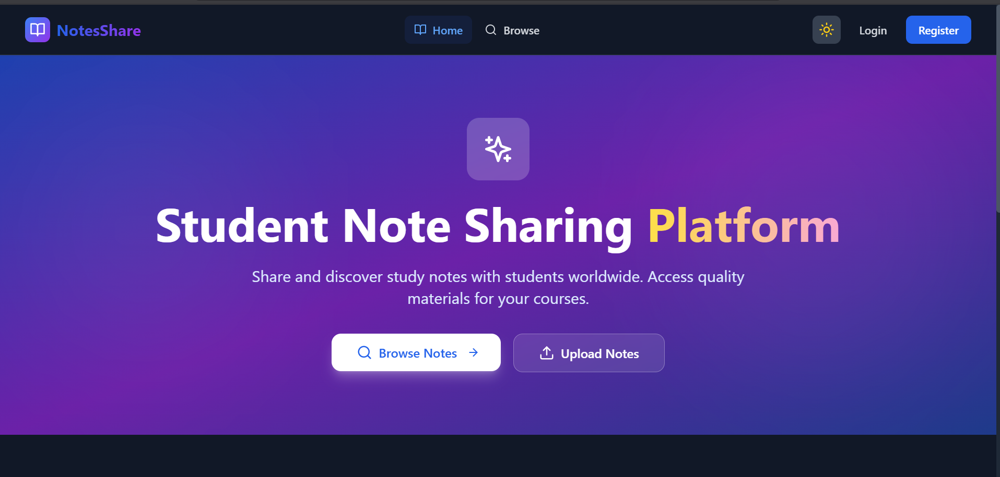

# Student Note Sharing Platform

A full-stack MERN application for students to share and discover study materials.



## Features

- **Authentication** - JWT-based loginm /register with role-based access
- **File Upload** - Share PDFs, DOCs, PPTs, and images
- **Search & Filter** - Find notes by subject, semester, or keywords
- **Social** - Like, bookmark, rate, and comment on notes
- **Profiles** - Public user profiles with stats and uploaded notes
- **Admin Panel** - Content moderation and user management
- **Dark Mode** - Toggle between light and dark themes

## Tech Stack

**Backend:** Node.js, Express.js, MongoDB, Mongoose, JWT, Multer

**Frontend:** React.js, Tailwind CSS, Framer Motion, Lucide Icons

## Quick Start

### Backend
```bash
cd backend
npm install

# Create .env file with:
# MONGO_URL=mongodb://localhost:27017/student-notes
# JWT_SECRET=your_secret_key
# PORT=5000

npm run dev
```

### Frontend
```bash
cd frontend
npm install

# Create .env file with:
# REACT_APP_API_URL=http://localhost:5000/api

npm start
```

Visit `http://localhost:3000`

## API Endpoints

| Endpoint | Description |
|----------|-------------|
| `POST /api/auth/register` | Register new user |
| `POST /api/auth/login` | Login user |
| `GET /api/notes` | Get all notes |
| `POST /api/notes/upload` | Upload note |
| `GET /api/auth/public-profile/:id` | View user profile |

## Screenshots

| Home | Browse | Profile |
|------|--------|---------|
|  |  |  |

## Deployment

**Backend (Heroku):**
```bash
heroku create your-app-name
heroku config:set MONGO_URL=your_db_url JWT_SECRET=your_secret
git push heroku main
```

**Frontend (Vercel/Netlify):**
- Build: `npm run build`
- Set `REACT_APP_API_URL` to your backend URL

---

Made with for students everywhere
